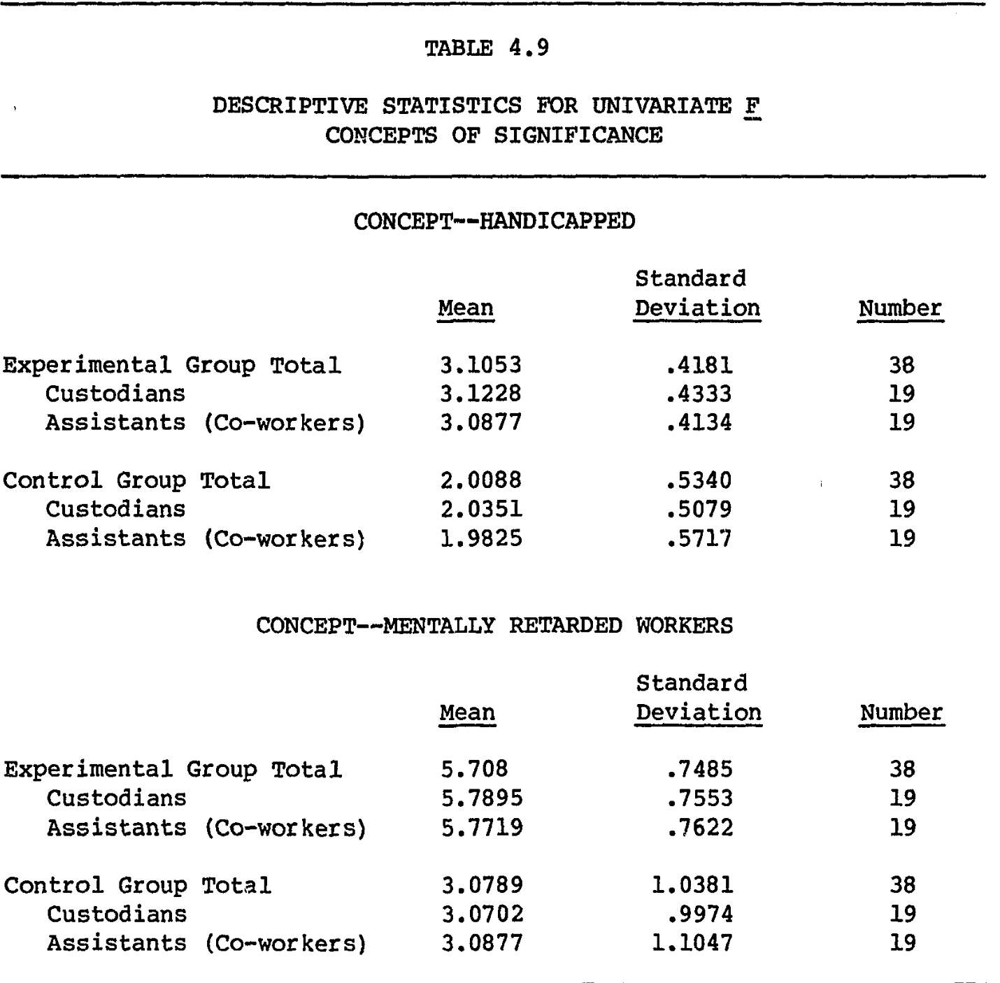
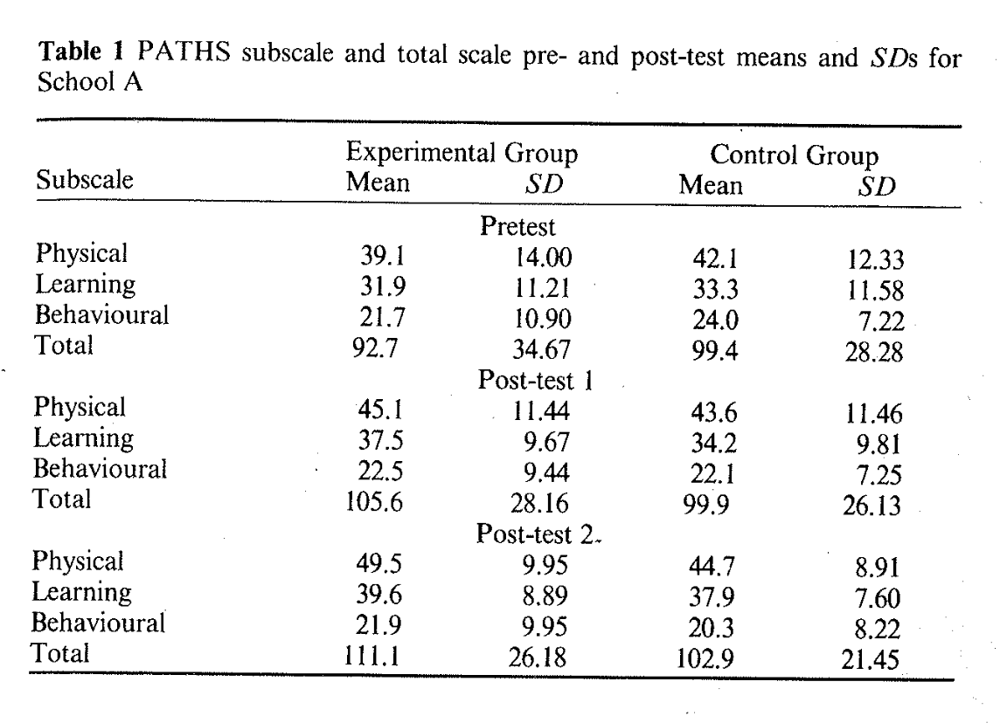
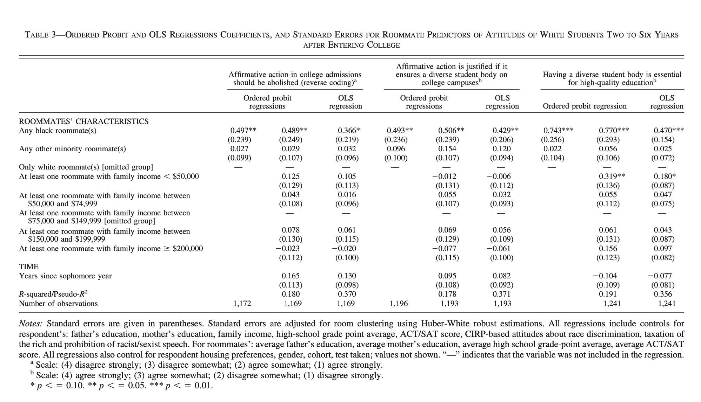
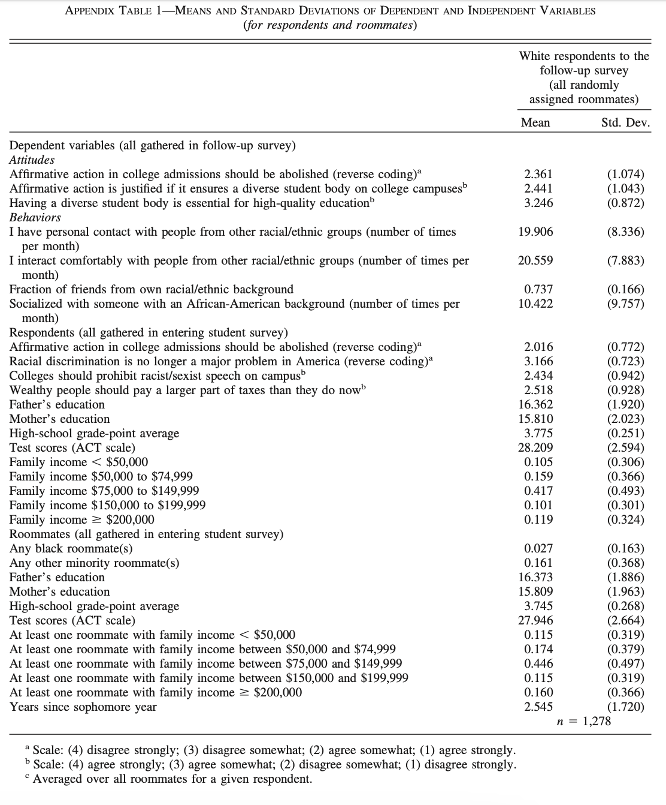
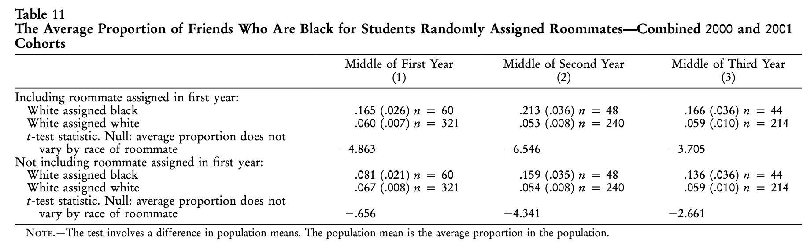
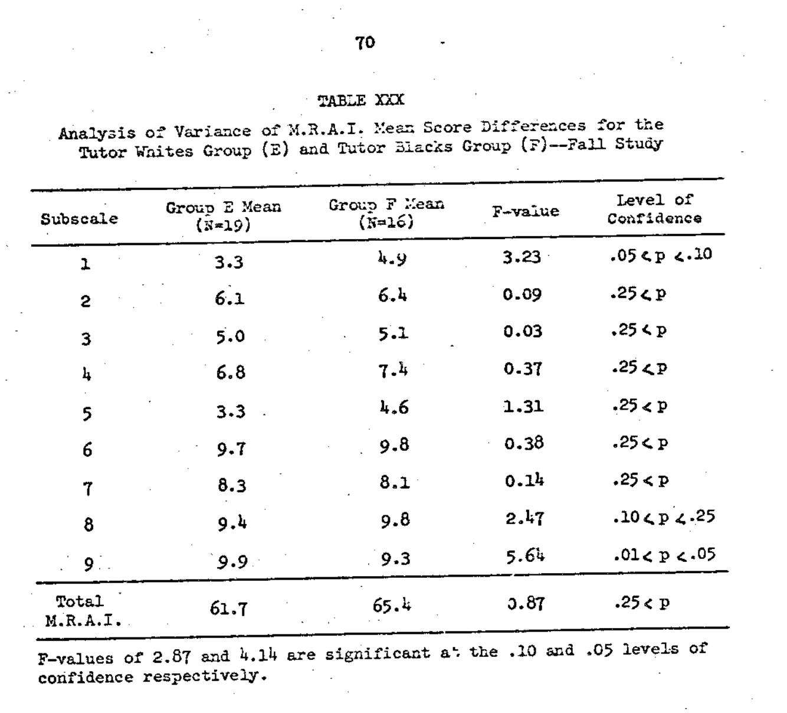
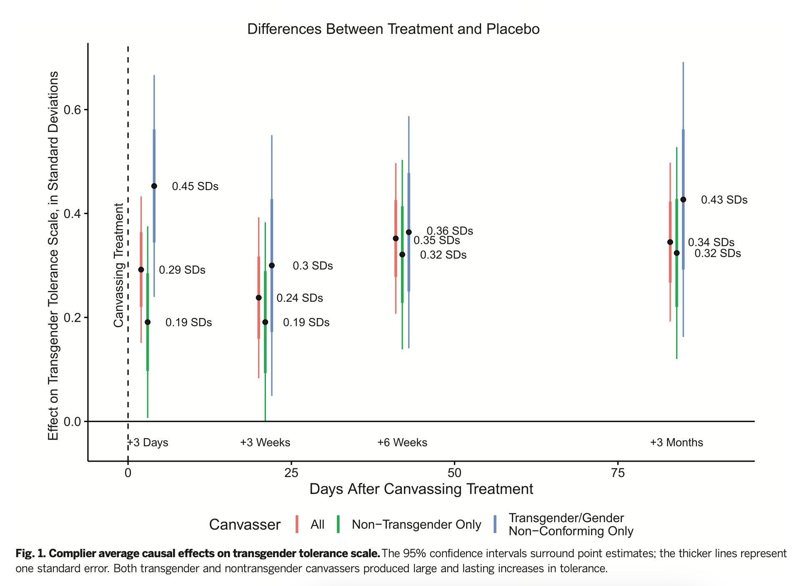
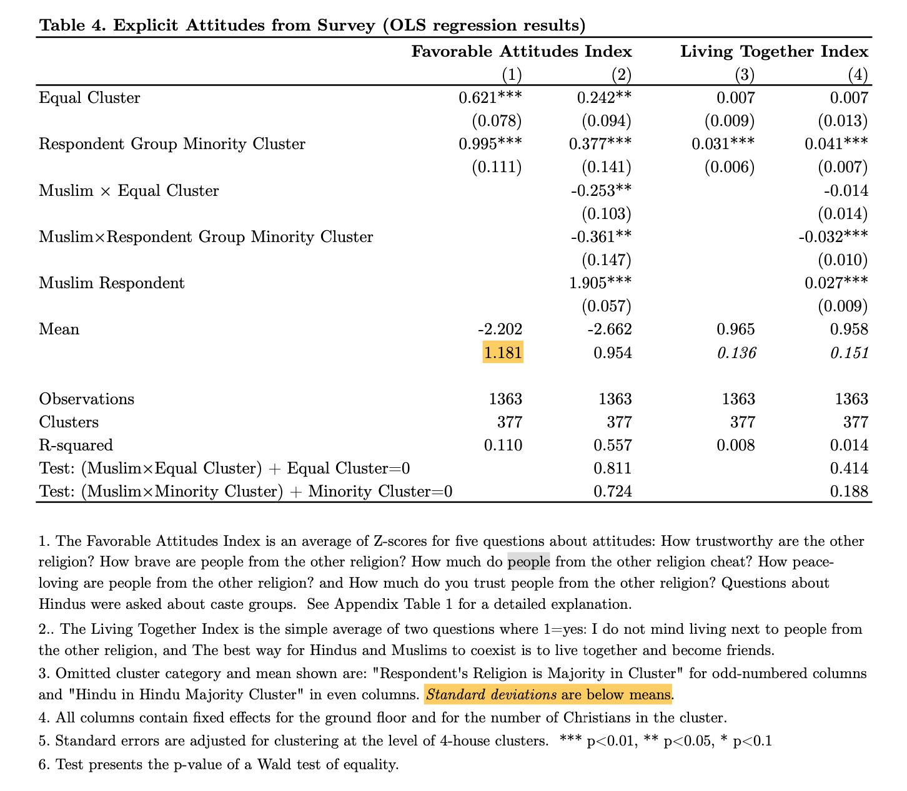

## Introduction

To do meta-analysis, you must first extract two pieces of information from each study in your database: a standardized mean difference (SMD) and its associated variance (or standard error). These numbers allow you to compare results across studies that may have used different outcome measures or scales.

This vignette walks through that process using the functions `d_calc` and `var_d_calc`, with examples drawn from [The Contact Hypothesis Re-evaluated](https://doi.org/10.1017/bpp.2018.25).

The contact hypothesis meta-analytic dataset is included, with small adjustments, in this package as `BLPlabtools::contact_data`. [The Contact Hypothesis Re-evaluated](https://doi.org/10.1017/bpp.2018.25)'s supplementary materials, including all studies discussed here, are available on the [Open Science Framework](https://osf.io/ttpvy/?view_only=https://osf.io/ttpvy/?view_only=).

Before we show you how to calculate these numbers, let's talk about what they mean.

### Standardized Mean Difference (SMD) and Variance

$$SMD = \frac{M_1-M_2}{SD}$$

In plain language: an SMD is the difference in average outcomes between the treatment and control groups (Average Treatment Effect) divided by the standard deviation (SD) of the outcome.

We calculate SMD with `d_calc` and its variance using `var_d_calc`. The standard error (SE) of an SMD is the square root of its variance. Our meta-analytic databases typically include all three.[^1]

[^1]: Our meta-analysis functions typically take `d` and `var_d` as their inputs, though technically `se_d` can generally be used instead of `var_d` . However, there might be functions or graphs that require one or the other, so it makes sense to record all three.

Some studies plainly report $M_1$, $M_2$, and $SD$, which makes calculating an SMD easy. Others report statistical summaries, which then need to be converted into an SMD using standard formulas. `d_calc` implements a selection of these formulas drawn from chapters 12 and 13 of [Cooper, Hedges, and Valentine (2009)](https://www.scholars.northwestern.edu/en/publications/the-handbook-of-research-synthesis-and-meta-analysis-2nd-edition).

In one instance — the difference in proportions estimator — we depart from those equations, which we'll explain in [section 3.2.3](#section323).

### d vs ∆

There are two basic ways to standardize your SMD. If you divide $M_1 - M_2$ by the $SD$ of the entire sample, your estimator is called Cohen's $d$. If you use an estimated $SD$ from just the control group, you get [Glass's ∆](https://www.statisticshowto.com/glasss-delta/) (Delta).

The Paluck lab generally prefers Glass's ∆ because we're interested in the efficacy of interventions relative to the population's baseline state, and we think that treatment might sometimes change the distribution of the outcome (i.e. heterogeneous treatment effects).

When the $SD$ of the control group isn't available but the $SD$ of the entire population is, we use the $SD$ of the entire population. When neither is available, or can't be figured out from a paper's results, we might have a problem. We discuss these issues more in [section 4](#section4).

### What your data should look like

Before diving into effect size calculations, it helps to know what columns you'll need in your meta-analytic database. Here's a peek at the `contact_data` structure:

```{r preview_contact_data}
library(BLPlabtools)
library(dplyr)
data(contact_data)

# View essential columns for effect size calculation
contact_data |>
  select(Study, statistic, unstand, sd_c, n_t, n_c, d, var_d, se_d) |>
  head(3)
```

**Essential columns you'll need to extract from papers:**

- **`study`**: Study identifier (author, year)
- **`statistic`**: Type of statistic reported (e.g., "d_i_m", "t_test", "reg_coef")
- **`unstand`**: The unstandardized statistic value (e.g., t = 2.5, β = 0.366)
- **`sd_c`**: Standard deviation of control group (when available)
- **`n_t`** and **`n_c`**: Sample sizes for treatment and control groups

**Columns you'll create with this package's functions:**

- **`d`**: Standardized mean difference (calculated via `d_calc`)
- **`var_d`**: Variance of effect size (calculated via `var_d_calc`)
- **`se_d`**: Standard error (square root of `var_d`)

**Optional but recommended columns:**

- **`what`**: Notes on where you found each piece of information (e.g., "Table 3, p. 45")
- **`unique_study_id`**: Numeric ID for clustering in meta-analysis
- **Moderator variables**: Any categorical or continuous variables you'll use for subgroup analyses

As you read papers and extract data, you'll fill in the "essential" columns. Then you can use `d_calc` and `var_d_calc` (as shown in [section 5](#section5)) to automatically generate the effect sizes and variances for your entire dataset.

The rest of this vignette walks through examples of calculating effect sizes one study at a time. In practice, you'll eventually automate this process for your entire dataset (see [section 5](#section5)).

## `d_calc` and `var_d_calc`

### `d_calc`

`d_calc` is a function that takes (up to) five parameters and returns an estimate of either ∆ or d, depending on what you standardize by. The first two parameters are essential, and the next three are only necessary depending on your input for the first parameter.

The five parameters are:

-   1: `stat_type`, where you put the kind of statistical results you're converting into ∆. Its possible values are:

    -   `d` or `s_m_d`, for when a paper provides its own estimate of d/∆/SMD.

    -   `d_i_m` for difference in means.

    -   `d_i_d` for difference in differences.

    -   `reg_coef`, `regression`, or `beta`, for the regression coefficient associated with treatment.

    -   `t_test` or `T-test` for a t-test.

    -   `f_test` or `F-test` or `F` for an F-test.

    -   `odds_ratio` for odds ratio.

    -   `log_odds_ratio` for log odds ratio.

    -   `d_i_p` for a difference in proportions.

    -   `unspecified_null` or `unspecified null` for when you can't figure out a precise estimate, but know that the overall effect is "not significant."

-   2: `stat`, the value of the statistic that you're recording or converting into SMD.

-   3: `sample_sd`, the standard deviation that you're using to standardize your estimate.

    -   If your `stat_type` is `d_i_m`, `d_i_d`, any variant of `reg_coef`, or `d_i_p`, this input is required. However, if your `stat_type` is `d`, `SMD`, `F test`, `t test`, `odds ratio`, or `log odds ratio`, then the `stat` already conveys information about the distribution of the variance, and `sample_sd` is not required.

-   4: `n_t` and 5: `n_c`, the sample sizes for treatment and control.

    -   These are only necessary when you are converting the results of an F test or t-statistic into SMDs.

To see all the conversion formulas, run `BLPlabtools::d_calc` (without parentheses).

### `var_d_calc`

`var_d_calc` takes three inputs:

-   1: `d`, which is typically generated by `d_calc.`

-   2: `n_t` and 3: `n_c`, the sample sizes for treatment and control.

The function first turns this into an (uncorrected) estimate of variance via

${\sigma^2_1} = \frac{n_t + n_c}{n_t \cdot n_c} + \frac{d^2}{2(n_t + n_c)}$

And then applies a correction for small sample size called Hedge's *g:*

$g = 1 - (3/((4 * (n_t + n_c - 2)) - 1))$

And the final variance estimate is

$\sigma^2 = \sigma^2_1 * g^2$

Standard error ($SE$) is the square root of variance. For meta-analysis, you typically need just one or the other, but the Paluck Lab's meta-analyses typically include both in case a future reader needs them.

## Calculating $\Delta$ and $\sigma^2$ with `d_calc` and `var_d_calc`

We now load the `BLPlabtools` library, which has the `d_calc` and `var_d_calc` functions. We'll also load the `contact_data` dataset from [The Contact Hypothesis Re-evaluated](https://doi.org/10.1017/bpp.2018.25) for reference.

```{r BLPlabtools}

library(BLPlabtools)
data(contact_data)
```

### The easy cases: difference in means, difference in differences, and, regression coefficients

#### Difference in means (d_i_m):

[DiTullio (1982)](https://www.proquest.com/docview/303259182) is a study of workplace integration programs aimed at reducing prejudice towards people with developmental disabilities. Here is table 4.9 (p. 76):

{width="600"}

We took "CONCEPT--MENTALLY RETARDED WORKERS" to be the dependent variable that best captured attitudes towards the outgroup.[^2]

[^2]: Figuring out what dependent variable is "best" can be tricky. Some papers present many outcomes that are all plausible measures of the true quantity of interest. Whenever possible, we advise pre-specifying which outcomes or categories of outcome to code before you start collecting data. But in situations like this, the meta-analyst needs to make a judgment call about which outcome is substantively closest to the true quantity of interest. Alternatively, you can average all measures together, or record them all separately. For [The Contact Hypothesis Re-evaluated](https://doi.org/10.1017/bpp.2018.25), we took one dependent variable per study.

$$
\begin{align*}
M_1 &= 5.708 \\
M_2 &= 3.0789 \\
SD_C &= 1.0381
\end{align*}
$$

Therefore,

$$\Delta = \frac{5.708 - 3.0789}{1.0381} = 2.533$$

Here is code to calculate ∆, variance, and SE:

```{r ditullio_results}
ditullio_results <- d_calc(stat_type = "d_i_m", stat = 5.708 - 3.0798, sample_sd = 1.0381)

ditullio_variance <- var_d_calc(d = ditullio_results, n_t = 38, n_c = 38)

ditullio_se <- sqrt(ditullio_variance)
```

Two notes about this effect size. First, you'll see a "what" column in `contact_data` that, for this study, says "Table 4.9 (p. 79)." This is where we recorded the place in the text that reports the standard deviation of the control group, which is often the hardest thing to pin down in a paper. Your readers (and your future self!) will thank you for taking and sharing notes like this.

Second, ∆ = 2.533 is a very large effect size. Δ ∈ [−1,1] is more typical in our experience.

#### Difference in differences (d_i_d):

Some studies present the mean outcomes for each group at both baseline and posttest. [Clunies-Ross & O'Meara (1989)](https://aps.onlinelibrary.wiley.com/doi/abs/10.1080/00050068908259566) tested an "attitude change programme" comprised of "controlled vicarious contact with peers with disabilities, disability simulations, and success oriented group experiences" (p. 271). Here is table 1 (p. 279):

{width="600"}

In these cases, we subtract the baseline values from the posttest values for both treatment and control, and divide the resulting difference by the $SD$ of the control group at baseline. This procedure creates more precise estimates because it controls for baseline differences between the two groups.

$$
∆ = \frac{(111.1-92.7)-(102.9-99.4)}{28.28} = 0.5268741
$$

This was for school A, and we repeated the same process for school B as a separate effect size estimate.

In code:

```{r dessel_effects}
dessel_school_a_effects <- d_calc(stat_type = "d_i_d", stat = (111.1-92.7)-(102.9-99.4), sample_sd = 28.28)

dessel_school_a_var <- var_d_calc(d = dessel_school_a_effects, n_t = 15, n_c = 15)

dessel__school_a_se <- sqrt(dessel_school_a_var)
```

Notice that we record the DiD calculation in the code itself for reproducibility (and also to make it easier to spot mistakes).

#### Regression coefficient (beta):

In a bivariate regression testing the relationship between treatment status and outcome, the $\beta$ coefficient is equivalent to the difference in means between the groups. Calculating the $SD$ from a regression table takes some guesswork (see [section 4](#section4)), but some studies report both $\beta$ and the $SD$ for the outcome.

[Boisjoly et al. (2006)](https://www.aeaweb.org/articles?id=10.1257/aer.96.5.1890) tested the effects of being randomly assigned a black or "other minority" roommate on the attitudes and behaviors of white college students.

Instead of a difference in means, we have linear regression coefficients from table 3, column 3 (p. 1899):

{width="600"}

We took Row 1, column 3 (0.366) as our main measure of unstandardized mean difference.[^3]

[^3]: We always take OLS coefficients if they are available rather than Probit coefficients (See [Gomilla (2021)](https://psycnet.apa.org/record/2020-71596-001) for discussion). However, a reader might note that $\beta$ imperfectly captures the mean difference between groups in this because the model includes controls; the intercept here is a (perhaps hypothetical) person whose values are set to zero for all parameters, not just the treatment indicator. As part of [The Contact Hypothesis Re-evaluated](https://doi.org/10.1017/bpp.2018.25), we emailed the authors to ask to replicate the original data, but unfortunately data were not available due to the researchers' agreement with the university. (We thank Greg Duncan kindly for his help.) $\beta$ is the best thing we have given these limitations. The resulting number might be an overestimate of the effect size, but not in a way that substantively changes our beliefs about the world. We get ∆ = 0.341, and the coefficient is significant at the p \< 0.05 level. Effect size estimates are just that: estimates.

While this table does not tell us about the distribution of the dependent variable, we find that in Appendix table 1 (p. 1903):

{width="600"}

For our main dependent variable ("Affirmative action in college admissions should be abolished (reversed)"), the $SD$ for the entire population of white students who were randomly assigned roommates is 1.073. We don't have enough information to figure out the $SD$ of the control group, so our SMD estimate here is of Cohen's $d$ rather than Glass's ∆.

Last, the authors tell us the size of the treatment and control groups on p. 1895: "of the 1,278 white respondents, 35 were assigned at least one black roommate, 98 were assigned at least one Asian roommate, 40 were assigned at least one Hispanic roommate, and 69 were assigned at least one “other race” roommate. The rest were assigned white roommates."

We calculated two separate SMDs, one corresponding to the effect on white students on being assigned a black roommate and one for being assigned "any other minority roommate:"

```{r boisjoly_results}
# Ns
black_roommate_treatment_n <- 35
other_minority_treatment_n <- 98 + 40 + 69 # 207
boisjoly_n_c <- 1278 - 35 - 98 - 40 - 69 # 1036

# black roommates
Bois_d_black_roommates <- d_calc(stat_type = "reg_coef", stat = .366, sample_sd = 1.074)
Bois_var_black_roomamtes <- var_d_calc(d = Bois_d_black_roommates, 
                                       n_t = black_roommate_treatment_n, 
                                       n_c = boisjoly_n_c)
Bois_se_black_roommates <- sqrt(Bois_var_black_roomamtes)

# other minority roommates
Bois_d_other_roommates <- d_calc(stat_type = "reg_coef", stat = .032, sample_sd = 1.074)
Bois_var_other_roomamtes <- var_d_calc(d = Bois_d_black_roommates, 
                                       n_t = other_minority_treatment_n, 
                                       n_c = boisjoly_n_c)
Bois_se_other_roommates <- sqrt(Bois_var_other_roomamtes)
```

By the way, the fact that $\beta$, SD, and the Ns were all reported in separate places in the paper is not at all atypical. You'll often have to read the entire paper carefully to find what you need to calculate ∆. However, even if everything you need is presented in a simple table, at least one author should still read every paper. it's the best way to figure out what a literature is really about.

### Converting statistical summaries into SMDs

Sometimes, papers report summary statistics that require more complex conversions. [Cooper, Hedges, and Valentine (2009)](https://www.scholars.northwestern.edu/en/publications/the-handbook-of-research-synthesis-and-meta-analysis-2nd-edition) provide formulas for converting t-tests, F-tests, log odds ratios, and odds ratios into SMDs. These conversions all produce estimates of Cohen's $d$ rather than Glass's ∆.

Here we'll show examples for the t-test and F-statistic from [The Contact Hypothesis Re-evaluated](https://doi.org/10.1017/bpp.2018.25). For differences in proportions, Instead of presenting odds ratios and log odds ratios examples, we'll introduce a novel estimator for converting differences in proportions to ∆.

#### t-test:

The standard conversion from a t-test to Cohen's $d$ is $d = t * \sqrt\frac{n_t + n_c}{n_t * n_c}$.

[Camargo, Stinebrickner, and Stinebrickner (2010)](https://doi.org/10.1086/653831) study the effects of interracial roommate assignments in the special environment of Berea college, a tuition-free college in Kentucky that assigns roommates in an unconditionally random way.[^4]

[^4]: Boisjoly et al., by contrast, worked with the admissions office of the studied school to control for all non-random determinants of roommate assignment.

Table 11 (p. 882) presents the following results on friend network composition over time:

{width="600"}

We take the latest possible result ("Middle of Third Year") for the effect that includes the roommate assigned in first year. (In a world where roommate assignment reduces prejudice, we would expect to see this partly manifesting as likelihood of white students' still being friends with their initially assigned black roommates.)

Our `stat` is `t = -3.705`. We take our Ns from that table as well: `n_t = 44` and `n_c = 214`.

In code:

```{r camargo_results}
Camargo_d <- d_calc(stat_type = "t_test", stat = 3.705, 
                                n_t = 44, n_c = 214)
                                
camargo_var <- var_d_calc(d = Camargo_d, n_t = 44, n_c = 214)

camargo_se <- sqrt(camargo_var)
```

#### F-test:

When we are comparing (only) two variances, the F statistic is equivalent to the square of the t-test. As a result, the formula for converting F to ∆ is the same as with t to ∆ except with the F inside the square root:

$d = \sqrt{F * \frac{n_t + n_c}{n_t * n_c}}$

[Sayler (1969)](https://www.proquest.com/docview/302483961?pq-origsite=gscholar&fromopenview=true) studied interracial contact for college students at local community centers. Here's table XXX[^5] (p. 70):

[^5]: The [Vin Diesel table](https://en.wikipedia.org/wiki/XXX_(2002_film)), if you will.

{width="600"}

In code:

```{r sayler_results}
sayler_results <- d_calc(stat_type = "F-test", stat = 0.87, n_t = 16, n_c = 19)
sayler_var <- var_d_calc(sayler_results, 16, 19)
sayler_se <- sqrt(sayler_var)
```

#### log odds ratios, odds ratios, and a novel difference in proportions estimator: {#section323}

**Log odds ratios** can be converted to d via $d = log(OR) * \sqrt{\frac{3}{pi}}$. Odds ratios can be logged and then put in the same formula. 

Neither of these estimators came up in [The Contact Hypothesis Re-evaluated](https://doi.org/10.1017/bpp.2018.25), though they did in subsequent meta-analyses. However, we try to avoid converting odds ratios or log odds ratios to ∆ whenever possible. As [Gomilla (2021)](https://psycnet.apa.org/record/2020-71596-001) writes, any given odds ratio "can translate into different Cohen’s d values, depending on the probability" of event incidence for the "dependent variable for control group participants" (p. 8).[^6]

[^6]: [Chen, Cohen & Chen (2010)](https://www.tandfonline.com/doi/full/10.1080/03610911003650383) propose that if incidence of a disease is 1% within a control group, then "OR = 1.68, 3.47, and 6.71 are equivalent to Cohen's \$d\$ = 0.2 (small), 0.5 (medium), and 0.8 (large), respectively'' (p. 862), with different proportions corresponding to equivalent effect sizes at a range of incidence rates. However, the populations and dependent variables in our meta-analyses are generally too heterogeneous for these sorts of heuristics.

As a solution to this, while we were working on [Prejudice Reduction: Progress and Challenges](https://www.annualreviews.org/content/journals/10.1146/annurev-psych-071620-030619), Donald P. Green proposed treating those proportions as draws from a Bernoulli distribution and calculating variance and $SD$ accordingly.

The $SD$ of the Bernoulli distribution is $$
\sqrt{ p (1-p)}
$$

where p is the proportion of some event — for Glass's ∆, the proportion in the control group.

Suppose an event occurs in 10% of control group participants and 15% of treatment group participants. In that case:

$$
\Delta = \frac{.15  -.1}{\sqrt{.1 (1. - .1})} = \frac{.05}{\sqrt{.09}} = 0.166
$$

When using `d_calc` to convert a difference in proportions to ∆, put the difference between as the `stat` and the rate of incidence of the event in the control group as `sample_sd`.

In code: `d_calc("d_i_p", .05, .1)`.

The intuition for this estimator is that maximum variance for a binary variable is a 50% chance of occurring, the point at which the two events are equally likely; as the probability approaches either one or zero, the outcome becomes more predictable, which means that variance decreases.

```{r d_i_p_intuition_and_demonstration}
# A visualization of the intuition behind this estimator: 
# distribution of SDs drawn from Bernoulli distribution
# SD gets larger as proportion approaches 50%, which is point of max randomness
proportions <- seq(from = 0, to = 1, by = 0.01)
SDs <- as.numeric(lapply(X = proportions, FUN = function(p){sqrt(p * (1 - p))}))

plot(proportions, SDs, type = "p", pch = 20, xlab = "Proportion", ylab = "Standard Deviation", main = "SD of Bernoulli Distribution")


# demonstration
# both of the following equations are implemented by d_calc, but here we spell them out

odds_ratio_to_d <- function(p1, p2) {
  # Calculate odds for each probability
  odds1 <- p1 / (1 - p1)
  odds2 <- p2 / (1 - p2)
  
  # Calculate odds ratio
  odds_ratio <- odds1 / odds2
  
  # Convert odds ratio to Cohen's $d$
  d <- log(odds_ratio) * sqrt(3) / pi
  return(d)
}

difference_in_proportion_calc <- function(p1, p2) {
  diff <- p1 - p2
  sd <- sqrt(p2 * (1 - p2))
  d <- round(diff / sd, digits = 3)
  return(d)
}

odds_ratio_to_d(.6, .3) 
difference_in_proportion_calc(.6, .3)  # pretty similar
# alternatively, use d_calc
BLPlabtools::d_calc("d_i_p", 0.6 - 0.3, 0.3)

# with smaller numbers?
odds_ratio_to_d(p1 = 0.06, p2 = 0.03)
BLPlabtools::d_calc("d_i_p", 0.06 - 0.03, 0.03)
# pretty different

```

Note that with this estimator, if an event does not occur in the control group, Glass's ∆ will be impossible to calculate because the numerator of the formula equals zero. In such cases, we calculated Cohen's \$d\$ instead by computing variance from the entire sample. (If the event doesn't occur in either group, your effect size is zero.)

### Unspecified nulls

Some studies, e.g. [Hall 1969](https://ir-api.ua.edu/api/core/bitstreams/8b53661b-99c5-4a2f-9e2d-603bfffb3eb0/content), don't tell you exactly what effect they find, just that it was not not significant. We set all of these cases to ∆ = 0.01 so we can include them in our main analyses. You can set these nulls to 0.00, or 0.001, or anything that substantively communicates "there was no effect", and get basically the same result.

`d_calc("unspecified_null")` will always return 0.01 no matter the values of the other parameters.

## Hard cases: non-standard conversions of results into SMDs {#section4}

Each of our meta-analyses has had edge cases that required bespoke solutions. Here we'll walk through two: figuring out ∆ when the meta-analytic outcome is different than the one the paper focuses on; and estimating an SMD from a regression table.

In general, we make all available efforts to figure out a "good enough" estimate of ∆, imperfect data notwithstanding. However if we really can't figure something out, we'll omit a study or just include it as part of a vote counting procedure.[^7]

[^7]: I.e., a tally of statistically significant positive, statistically significant negative, and null results. A recent paper called vote counting procedures "antiquated" ([Mathur & VanderWeele 2018](https://onlinelibrary.wiley.com/doi/full/10.1002/sim.8057) and we agree that statistical significance is not obviously a good signal of whether a given piece of evidence is meaningful or substantive. However, vote counting can sometimes provide a novel way to look at things, e.g. a higher number of nulls than expected is a "hoop test" ([Collier 2011](https://polisci.berkeley.edu/sites/default/files/people/u3827/Understanding%20Process%20Tracing.pdf)) against publication bias.

### When *your* estimand isn't the paper's

[Brookman and Kalla (2016)](science.org/doi/10.1126/science.aad9713) is a landmark study of how a brief conversation with canvassers on trans issues can durably alter transphobic attitudes. Figure 1 displays the main results:

{width="600"}

These results are already presented in terms of fractions of an SD, which makes the analyst's life much easier. However, our meta-analysis was specifically about the effects of intergroup contact, rather than intergroup contact + other treatments, and this study features a canvassing component that, as this figure shows, influences the dependent outcome independent of intergroup contact.

Admittedly, many studies in our experiment tested intergroup contact in conjunction with other treatments, e.g. a conversation about race issues ([Sorensen 2010](https://www.proquest.com/docview/761442605?pq-origsite=gscholar&fromopenview=true)) or an invitation to ask a member of the outgroup questions about her life ([Evans 1976)](https://psycnet.apa.org/record/1976-27859-001). However, in this case, we already know from Figure 1 that *most* of the change in attitudes is accounted for by the canvassing component; at a 3 month follow-up, a conversation with a cis canvasser led to a reduction in transphobic attitudes of d = 0.32, vs. 0.43 for trans canvassers. So the estimate of d = 0.43 as an estimate of the effects of intergroup contact would probably be an overestimate of the effects of intergroup contact by itself.

If whether a subject talked to a trans or cis canvasser was randomly assigned, then $d = 0.43-0.32 = 0.11$ would be an unbiased estimate of the effects of talking to a trans person above and beyond the effects of the conversation. However, when we emailed David and Josh to ask about this, they told us that assignment varied across places where conversations took place ("turfs"), and that it would take a fair bit of work for the authors to recreate the randomizations and account for all possible assignments with randomization inference. This did not seem to us like a reasonable request on our part just to get an answer that, in all likelihood, was going to be very similar to $d = 0.11$. So we took that as our estimate, imperfect though it may be.[^8]

[^8]: A few thoughts on this.

    First, when in doubt, write to the authors; papers do not communicate everything researchers know about their subject.

    Second, although $d=0.11$ is a comparatively small effect size (the overall meta-analytic estimate in this paper was $∆ = 0.27$), we consider this one of the strongest pieces of evidence for when and where contact reduces prejudice for a few reasons:

    -   Effects persisted for three months after treatment.

    -   This article had open data and a detailed pre-analysis plan, which were both rarities in the assembled dataset and which increase our confidence in the estimate.

    -   This paper's careful design allowed us to disentangle the effects of intergroup contact vs. the other elements of treatment. Other papers in our dataset did not allow for these kinds of fine-grained measurements, so they might be overestimates of the effects of contact if the non-contact elements of treatment also meaningfully affected the outcomes.

### Calculating standardized mean difference from regression output

Some studies, particularly by economists, present results from a regression output. It can take some work to translate these results to ∆.

First, you should read the entire paper carefully to see if the data you need is reported somewhere you didn't expect. We touched on [Boisjoly et al. 2006)](https://www.aeaweb.org/articles?id=10.1257/aer.96.5.1890) in section 3.1.3; the same was true with [Barnhardt (2009)](https://www.povertyactionlab.org/evaluation/near-and-dear-evaluating-impact-neighbor-diversity-inter-religious-attitudes), where table 4 in the appendix helped a lot (we've highlighted the relevant section because it's relatively easy to miss):

{width="600"}

Second, if a simple regression model is reported without any controls, you can divide $\beta$ by $se$ to get the t-statistic, which can be converted to $d$ in a routinized way with `d_calc`. [^9]

[^9]: Alternatively, you can multiply the standard error of the intercept by the square root of N for the control group and get a reasonable estimate of the $SD$ of the control group, but you're probably better off just converting to T.

Third, if you can't find the data you need, email the authors to ask if the data can be made available to you, or if not, if they can calculate the standard deviation of the dependent variable (for the entire population for Cohen's \$d\$or just the control group for Glass's ∆).

Fourth, if you can't find what you need in the paper and the authors can't help, you'll need to make a judgment call. One option is to discard the study on the grounds that you could not figure out a specific effect size. Another is to include it in a vote counting procedure. A third is to do your best with what you have, e.g. converting $\frac{\beta}{SE}$ to T and then to d regardless of the controls. (If you go that route, you might wish to run simulations to see how far off your estimate is under different scenarios, for instance if the other control variables have little or substantial explanatory power.)

No matter what you choose for a case like this, we recommend you document your choices carefully for inclusion in your supplementary materials.

## Incorporating `d_calc` and `var_d_calc` into your analysis scripts

When we wrote TCHR, we had one function that combined the results of `d_calc` and `var_d_calc` into a table and a script that recorded the those calculations for every study. We then copied and pasted that script's results into our final dataset.

For our [next](https://www.annualreviews.org/content/journals/10.1146/annurev-psych-071620-030619) [two](https://doi.org/10.1177/15291006231221978) meta-analyses, we incorporated `d_calc` and `var_d_calc` directly into our analysis scripts with the `mapply` and `dplyr::mutate` functions. Here is how that woudl have looked if applied to the contact hypothesis data:

```{r d_and_var_d_creation_script}
library(dplyr, warn.conflicts = F) 
dat_with_new_ds <-  contact_data |> 
  select(-c(d, se_d, var_d)) |>  # delete vars and then reproduce them
  mutate(d = mapply(
          FUN = d_calc,
          stat_type = statistic,
          stat =  unstand,
          sample_sd = sd_c,
          n_t = n_t,
          n_c = n_c),
        var_d = mapply(
          FUN = var_d_calc,
          d = d,
          n_t = n_t,
          n_c = n_c)) |> 
    mutate(se_d = sqrt(var_d))
```

This script uses variables in the dataset as inputs and returns a dataset with `d`, `var_d`, and `se_d`.

This approach will ultimately save you a fair bit of time, reduce a possible source of user error by eliminating the copy and paste step, and make a larger portion of your workflow computationally reproducible. To facilitate this step, it pays to have columns in your dataset corresponding to `stat_type`, `stat`, `sample_sd`, `n_t`, and `n_c`.

## Further reading

See [this page on SMDs](https://handbook-5-1.cochrane.org/chapter_9/9_2_3_2_the_standardized_mean_difference.htm) from the Cochrane collaboration and the `escalc` [documentation](https://wviechtb.github.io/metafor/reference/escalc.html) from the `metafor` package for more information and discussion.

## Next up

[Performing meta-analysis the Paluck Lab way](meta-analysis-vignette.html).
