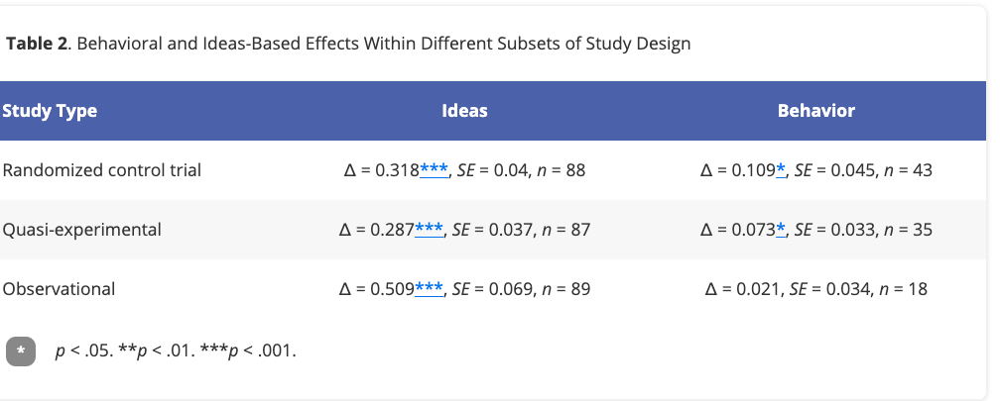

```{r, include = FALSE}
knitr::opts_chunk$set(
  collapse = TRUE,
  comment = "#>"
)
```

# Introduction

Now that we [have our vectors of ∆, variance, and standard errors for each paper](d-calc-vignette.html), it's time to perform a meta-analysis—the statistical procedure by which we combine results from multiple studies to estimate an overall effect.

## What is meta-analysis?

**Meta-analysis** pools effect sizes across studies to answer: "What is the average effect of this intervention/phenomenon across all available evidence?" Instead of relying on a single study's estimate, we synthesize many studies' results, weighted by their precision (studies with larger samples get more weight).

**Why meta-analysis matters:**

- **Increased statistical power**: Combining studies gives us more precise estimates than any single study
- **Generalizability**: We can see if effects hold across different populations, settings, and methods
- **Moderator analysis**: We can test whether effects vary by study characteristics (design, population, intervention type, etc.)

## Why clustering matters

A key challenge in meta-analysis is that **effect sizes from the same study are not independent**. If a study reports results for multiple outcomes or subgroups, those estimates share:

- The same participants
- The same research team and methods
- The same setting and time period

**Cluster-robust standard errors** account for this dependence by treating all effect sizes from the same study as a "cluster." This gives us accurate standard errors and prevents us from over-stating our precision.

For example, if a study reports effects on both attitudes and behavior, those two effect sizes are correlated—they come from the same intervention affecting the same people. Without clustering, we'd incorrectly treat them as independent, leading to overly narrow confidence intervals.

## What this vignette covers

The main function in this vignette is `map_robust()`. We'll demonstrate how to use it with our built-in datasets:

- **`sv_data`**: From "[Preventing Sexual Violence —A Behavioral Problem Without a Behaviorally-Informed Solution](https://doi.org/10.1177/15291006231221978)"
- **`contact_data`**: From "[The Contact Hypothesis Re-evaluated](https://doi.org/10.1017/bpp.2018.25)"

## What your data should look like

Before running meta-analyses, your dataset should have these essential columns:

```{r preview_sv_data, echo=FALSE}
library(BLPlabtools)
library(dplyr)
library(knitr)

# Show structure of meta-analysis data
sv_data |>
  select(unique_study_id, author, year, behavior_type, d, var_d, se_d) |>
  head(5) |>
  kable()
```

**Required columns:**

- **`d`**: Standardized mean difference (Cohen's d or Glass's ∆) for each effect size
- **`var_d`**: Variance of the effect size
- **`unique_study_id`**: Numeric identifier grouping all effects from the same study (for clustering)

**Recommended columns:**

- **`se_d`**: Standard error (square root of `var_d`)—some functions may use this
- **`author`** and **`year`**: Study identifiers for your records
- **Moderator variables**: Any variables you'll use for subgroup analyses (e.g., `behavior_type`, `study_design`, `population`)

If your data is structured this way (which you should have after following the [d-calc vignette](d-calc-vignette.html)), you're ready to run meta-analyses.

## 1 The easy case: combining all estimates into a single pooled effect size

`map_robust` is a wrapper around a pre-existing function from the `metafor` package called `robust`, which is itself a wrapped around the function `rma`. See the `man` pages for those functions for full details.

`map_robust` takes a dataset and returns a data frame with an N of the number of data points; an N for the number of studies; a ∆ signifying the pooled effect size; a standard error; and a p value.

```{r single_pooled_eff_size}
library(BLPlabtools)
sv_data |> map_robust()
```

This output tells us:

- **N_studies = 295**: We have 295 unique studies
- **N_estimates = 489**: Those studies contribute 489 total effect sizes (some studies report multiple outcomes)
- **Delta = 0.28**: The average effect size across all studies is 0.28 standard deviations
- **se = 0.03**: The standard error of this pooled estimate
- **pval < 2e-16**: The effect is highly statistically significant
- **I2 = 94.19%**: High heterogeneity—effect sizes vary substantially across studies

### Understanding the output

In a published meta-analysis, this overall pooled effect becomes your main finding. For example, in the Contact Hypothesis paper, we reported an overall effect size similar to this in our main results table:


This is equivalent to running the following metafor code:
```{r robust_rma}
library(metafor)
robust(x = metafor::rma(yi = sv_data$d, vi = sv_data$var_d), 
       cluster = sv_data$unique_study_id)
```

Our function is different in a few respects. First, it's designed to take in a dataset via a piped operation (`|>`), which was actually the main reason we wrote it in the first place (we were in the habit of using a lot of pipes). Second, so long as your dataset contains variables called `d`, `var_d`, and `unique_study_id`, it's a lot easier to type. Third, it returns a truncated output that corresponds to the information we were actually recording in our results sections.

### 1.1 A note about clustering

Clustering accounts for the fact that multiple effect sizes from the same study are not independent—they share the same participants, setting, and research team. By clustering at the study level, we get more accurate standard errors that account for this dependence.

Our meta-analyses cluster at the level of study. You could also cluster at the level of a paper, or of a team of authors, or at no level at all. If you run our function on a dataset where each unique_study_id corresponds to only one row in the dataset, it's equivalent to not clustering. We'll demonstrate that with `BLPlabtools::contact_data`:

```{r contact_data_demonstration}
library(dplyr)
contact_data |> select(-unique_study_id) |> # remove unique study id to reconstruct it
  group_by(name_short) |> mutate(unique_study_id = cur_group_id()) |>
  map_robust()
#' note: this Delta is a little different than the one we report in TCHR
#' we used Stata at the time to calculate the pooled average effect size
#' (and probably a few other small differences)

# now robust analysis
robust(x = metafor::rma(yi = contact_data$d, vi = contact_data$var_d), 
       cluster = contact_data$unique_study_id)

# same as if we drop the clustering information
rma(yi = d, vi = var_d, data = contact_data)
```

If you want to cluster at a different level, or call your cluster variable something different and modify the function accordingly, go ahead! Every meta-analysis is different, and we encourage you to modify these functions to serve your own needs. (We typically have a `functions` folder in our replication archives where we keep all our custom functions, which is a nice way to keep your function files organized separately from your scripts.)

## 2 Moderator analyses: Do effects vary by study characteristics?

After establishing an overall pooled effect, we typically want to know: **Does the effect size differ across different types of studies or outcomes?** This is called **moderator analysis** or **subgroup analysis**.

### Why run moderator analyses?

High heterogeneity (I² > 75%) suggests that effect sizes vary substantially across studies. Moderator analyses help us understand this variation by testing whether effects differ by:

- **Study design** (RCTs vs. quasi-experiments vs. observational studies)
- **Outcome type** (attitudes vs. behaviors; short-term vs. long-term outcomes)
- **Population** (children vs. adults; different cultural contexts)
- **Intervention characteristics** (dosage, delivery method, theoretical approach)

### Example: Effects by behavior type

In "Preventing Sexual Violence," we wanted to compare effects on **ideas** (attitudes, beliefs) versus different types of **behaviors** (perpetration, victimization, bystander actions, involvement). Here's how we do this with the split-apply-combine strategy:

```{r split_by_behavioral_ideas_outcomes}
library(purrr)
library(dplyr)
sv_data |> split(~behavior_type) |> map(map_robust) |> bind_rows(.id = "behavior_type")
```

This code:

1. **Splits** the data by `behavior_type` into separate datasets
2. **Applies** `map_robust()` to each subset
3. **Combines** the results back into one data frame

Each row now shows the pooled effect for one behavior type. For example, we can see that:

- **Bystander** behaviors: ∆ = 0.18 (27 estimates from 17 studies)
- **Ideas**: ∆ = 0.35 (346 estimates from 253 studies)
- **Perpetration**: ∆ = 0.11 (62 estimates from 51 studies)

This moderator analysis tells us that interventions have **larger effects on attitudes/beliefs than on actual behaviors**—a substantively important finding!

### How this appears in published papers

Here's how this moderator analysis looked in our published table:



**Note**: If a subgroup has only one effect size, the output will show that single study's results (not a "pooled" effect). Always note this for readers when it occurs. 

## 3 Making publication-ready tables out of subgroup analyses
If we apply a few more functions, we can actually get pretty close to a publication-ready table. 

`dplyr::bind_cols()` combines multiple data frames (in this case, a list of lists) into a single data frame.

```{r split_plus_bind_cols}

sv_data |> split(~behavior_type) |> map(map_robust) |> 
  bind_rows(.id = "behavior_type")
```

Which you can turn into a variety of formats, e.g LateX or markdown, via `knitr::kable()`:

```{r split_plus_kable}
library(knitr)
sv_data |> split(~behavior_type) |> map(map_robust) |> 
  bind_rows() |> kable('markdown')
```

Here is a small function that add stars to text corresponding to p values:
```{r significance_stars}
get_significance_stars <- function(pval) {
  sapply(pval, function(x) {
    if (is.na(x)) {
      ""
    } else if (x < 0.001) {
      "***"
    } else if (x < 0.01) {
      "**"
    } else if (x < 0.05) {
      "*"
    } else {
      ""
    }
  })
}
```

Here we apply this function directly to the R code, and modify the columns to combine the ∆ and se into one column with the format `∆ (se)`: 

```{r closer_to_pub_ready_table}
sv_data |> split(~behavior_type) |> map(map_robust) |> 
  bind_rows(.id = "behavior_type") |> 
  mutate(delta_se = sprintf("%.3f%s (%.3f)", 
                            Delta, 
                            get_significance_stars(pval), se)) |> 
  select(behavior_type, N_studies, delta_se)
```

Finally, we can use the [great table](https://gt.rstudio.com/) library (`gt`) library to format everything nicely and add explanatory notes:

```{r pub_ready_table_with_gt}
library(gt) 
sv_data |> split(~behavior_type) |> map(map_robust) |> 
  bind_rows(.id = "behavior_type") |> 
  mutate(delta_se = sprintf("%.3f%s (%.3f)", 
                            Delta, 
                            get_significance_stars(pval), se)) |>
  select(behavior_type, N_studies, delta_se) |> 
gt() |>
  tab_header(
    title = "∆ by category of dependent variable") |>
  cols_label(
    behavior_type = "Behavior type",
    N_studies = "N (Studies)",
    delta_se = "∆ (se)"
  ) |>
  tab_source_note(
    source_note = "* < 0.05, ** < 0.01, *** < 0.001.")
 
```

`gt` has a function called `as_latex()` that will convert this all into latex code directly.

## 4 Next up
[Writing your meta-analytic paper](writing-metas-vignette.html).
